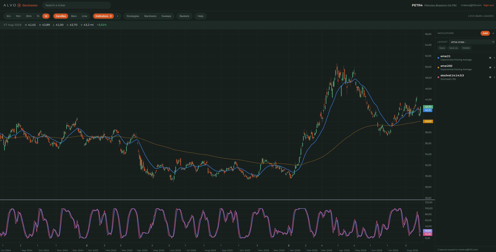
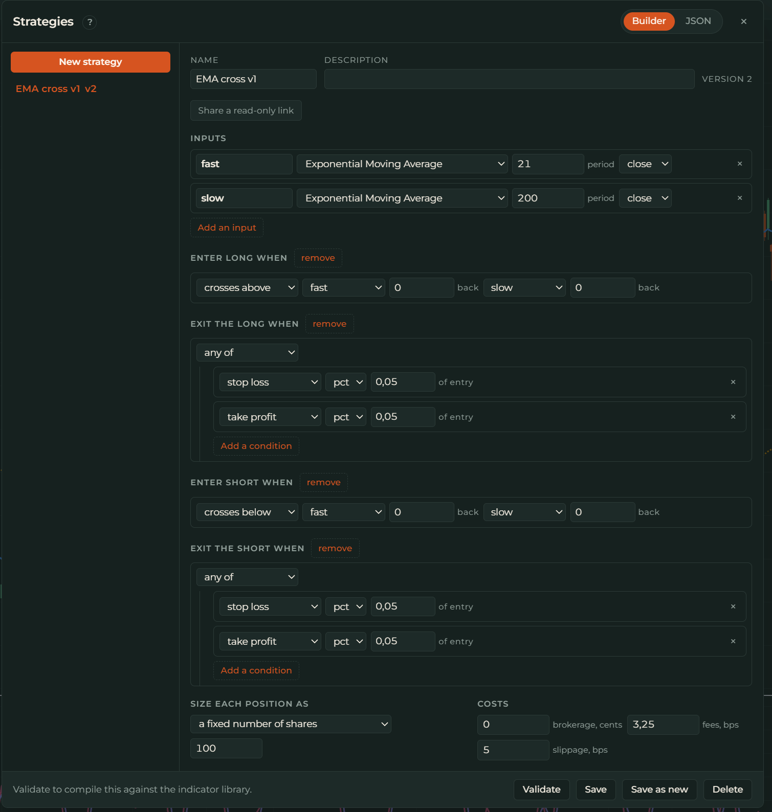
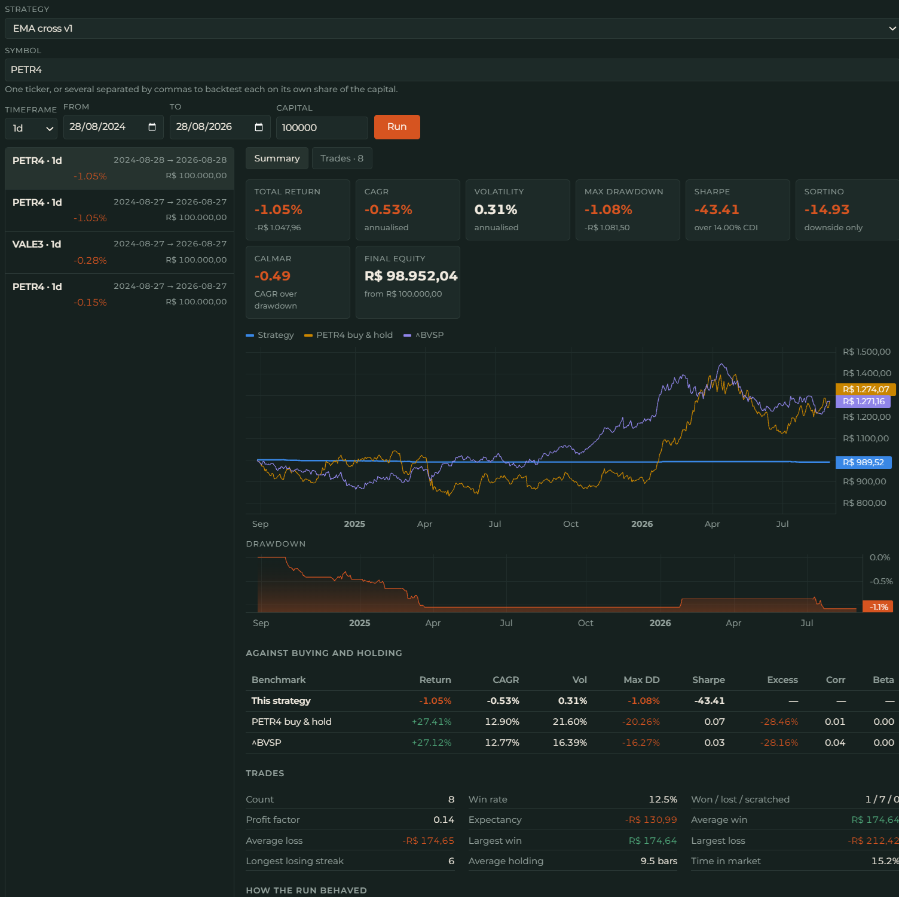
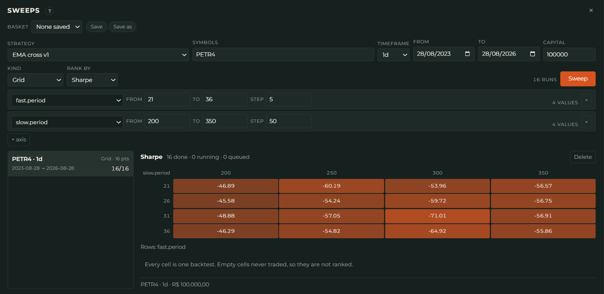
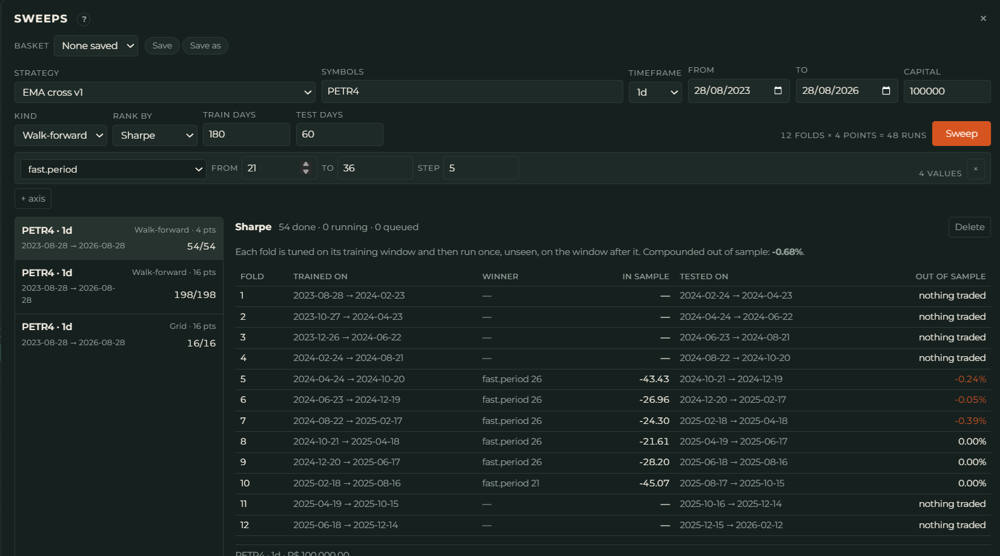
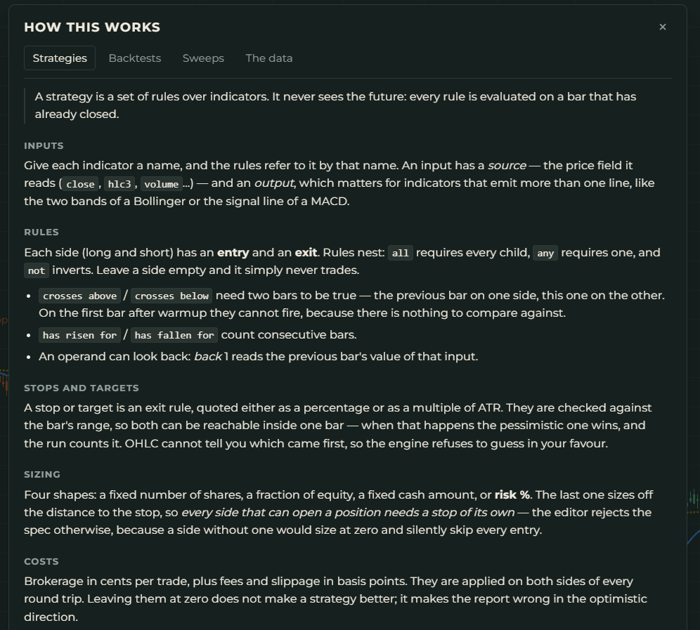

# ALVO Backtester

[](https://github.com/mhetem/ALVO-Backtester/actions/workflows/ci.yml)
[](https://go.dev)
[](https://svelte.dev)
[](https://www.postgresql.org)
[](LICENSE)

**Live at [alvoresearch.com](https://alvoresearch.com).**

A charting client and backtesting engine for the Brazilian markets, built from scratch in Go and
Svelte. It ingests OHLCV data from [brapi.dev](https://brapi.dev), stores it in PostgreSQL, and
serves it as candlestick or bar charts across five timeframes — **5m, 15m, 30m, 1h and 1d**.

On top of that sit **37 technical indicators** written from first principles as streaming
O(1)-per-bar updates, a **backtesting engine** that executes strategies composed from those
indicators through a visual rule builder, and **parameter sweeps with walk-forward validation**.

Everything runs as one Docker image on a single ARM box: the Go binary, the built frontend and
the migrations, with Caddy terminating TLS in front and Postgres beside it.

**Contents** — [Screenshots](#screenshots) · [At a glance](#at-a-glance) · [Motivation](#motivation) ·
[Features](#features) · [What it won't tell you](#what-it-wont-tell-you) ·
[Universe and depth](#universe-and-depth) · [Stack](#stack) · [Architecture](#architecture) ·
[Key decisions](#key-decisions) · [Running it](#running-it) · [The CLI](#the-cli) ·
[Configuration](#configuration) · [API](#api) · [Testing](#testing) ·
[CI and releases](#ci-and-releases) · [Deploying it](#deploying-it) · [Status](#status) ·
[License](#license)

## Screenshots

|  |  |
|---|---|
| <br>**Charts** — any tracked symbol at any of five timeframes, indicators stacked as overlays or in their own panes, layouts saved per user. | <br>**Strategy builder** — entry and exit as a rule tree, indicator inputs declared once and referenced by line, stops and targets as their own leg. |
| <br>**Backtest report** — equity against benchmark, the drawdown envelope, per-sleeve breakdown, and the trade list drawn onto the price chart. | <br>**Sweeps** — a grid over a strategy's parameters read as a heatmap, every point an ordinary backtest run through the same queue. |
| <br>**Walk-forward** — parameters chosen on each in-sample window, scored on the out-of-sample window that follows. The right-hand column is the honest one. | <br>**Help** — the pages document the traps, not the buttons: what the data can't tell you and which number to distrust. |

## At a glance

Built solo over four weeks, in sixteen phases, from an empty repository to a deployed public
site.

| | |
|---|---|
| **Backend** | ~19k lines of Go across 11 packages, standard-library `net/http` only — no web framework, no router dependency, no ORM |
| **Tests** | 398 test functions in 61 files, ~10k lines, run under `-race` in CI. No container or network dependency |
| **Frontend** | ~9k lines of Svelte 5 (runes) + ~2.5k of TypeScript, 16 components, two runtime dependencies |
| **Database** | 19 goose migrations, 12 sqlc query files, ~713k candle rows in production |
| **Indicators** | 37, each written from scratch as a streaming O(1)-per-bar update and pinned against a Python reference |
| **API** | 37 routes, JWT access tokens with opaque refresh tokens in Postgres, per-IP and per-user rate limiting |
| **Deployment** | Multi-stage Docker build → one distroless image, `docker compose` on an Oracle Ampere A1, Caddy + Let's Encrypt |
| **Documentation** | [BUILD_PLAN.md](BUILD_PLAN.md) — 3,400 lines recording every phase, the reasoning behind each decision, and 20 documented traps |

**What this project demonstrates:** designing a data pipeline against a metered third-party API;
numerical code where correctness is not obvious and has to be pinned by tests; a
domain-specific language (the strategy rule tree) with its own parser, validator and compiler;
a database-backed job queue; and a deployment that had to survive on the cheapest box that
exists.

## Motivation

Every retail backtester either costs money, runs on US equities, or lies to you about the
result. The Brazilian market gets the third treatment worst: the data is harder to come by,
corporate actions are frequent and messy, and the tooling that does exist tends to fill orders
at the price the signal fired on.

ALVO is the tool I wanted — B3 symbols, real session boundaries, real lot and tick sizes — built
so that the numbers it produces are ones I would actually act on. That constraint drove most of
the design:

- **Signals evaluate on bar close and fill at the *next* bar's open.** Structural, not a
  convention that a future change can quietly break.
- **Money is `int64` centavos everywhere.** An equity curve that drifts a few centavos per trade
  over 5,000 trades is wrong by a visible amount.
- **Costs and slippage are modelled by default**, at what B3 actually charges, not at zero.
- **Splits adjust the share count** rather than reading as a 50% crash; dividends are credited
  as cash.
- **Symbols that leave an index keep being ingested**, so the sample doesn't quietly become the
  set of companies that survived.

And where the tool *can't* be honest, it says so out loud — see
[What it won't tell you](#what-it-wont-tell-you). A backtester that hides its caveats is worse
than no backtester.

## Features

### Charts

- Any symbol in the tracked universe at **5m, 15m, 30m, 1h or 1d**, as candlesticks or bars,
  panned and zoomed back through five years.
- **Only 5m and 1d are ever fetched and stored.** 15m, 30m and 1h are resampled on read against
  session-aligned buckets, so switching timeframes costs no API quota and no storage.
- Paging runs backwards on fold boundaries rather than on base rows, so panning left never
  produces a half-formed bar at the seam.
- **Chart layouts save per user** — symbol, timeframe, mode and the full indicator stack with
  its parameters and colours. Signed-out layouts live in `localStorage` and stay there.
- Exchange-local timestamps on the axis, B3 number formatting (`31,25`), a two-row time axis,
  and a light/dark theme the chart reads out of CSS custom properties rather than duplicating.

### Indicators

**37 indicators**, each in its own file, each a streaming `Indicator` that takes one bar at a
time and updates in constant space:

| Group | |
|---|---|
| **Overlay** | SMA, EMA, WMA, HMA, DEMA, TEMA, VWAP (rolling), Bollinger Bands, Keltner Channels, Donchian Channels, Ichimoku Cloud, Parabolic SAR, SuperTrend |
| **Momentum** | RSI, MACD, Stochastic, Stochastic RSI, CCI, ADX, Aroon, Williams %R, Momentum, Rate of Change |
| **Volatility** | ATR, Standard Deviation, Historical Volatility, Chaikin Volatility |
| **Volume** | OBV, Accumulation/Distribution Line, Money Flow Index, Chaikin Oscillator, Volume MA, VWMA |
| **Structure** | Pivot Points, Fibonacci Pivots, Williams Fractals, ZigZag |

- **A registry, not a switch statement.** Every indicator declares its name, group, parameters
  with bounds and defaults, outputs, and per-output bar offsets. The API's catalog endpoint, the
  frontend's picker, the strategy validator and every error message are all generated from it.
- **Priming, not restarting.** Panning left loads a page primed with exactly as much prior data
  as the indicator needs — an SMA(200) asks for 199 bars, and each indicator answers for itself
  through `PrimeBars()`. Without it, every pan-left would draw a new warmup hole.
- **Every spelling collapses to one canonical key.** `ema:9`, `ema:period=9` and `ema` with the
  default all parse to the same thing, so a saved layout can't drift under a library change.
- **Correctness is pinned, not assumed.** A golden fixture of 200 real PETR4 bars is checked
  against a Python reference implementation, and the priming property is tested separately on
  2,000 synthetic bars.

### Strategies

A strategy is a **declarative JSON rule tree** stored in `JSONB` — not embedded scripting — with
its own spec, parser, validator and compiler in `internal/strategy`.

- **Inputs declared once, referenced by line.** `macd.signal`, `bb.upper`, `ichimoku.senkou_a` —
  one declaration reaches every line an indicator emits. Inputs may chain into each other, with
  cycle detection.
- **Combinators and comparators:** `all` / `any` / `not` over `gt`, `lt`, `gte`, `lte`, `eq`,
  `crosses_above`, `crosses_below`, `rising`, `falling`, `between`.
- **Long and short each get their own leg.** A spec whose two entries fire on the same close
  resolves deterministically — long wins.
- **Stops and targets are not conditions.** `stop_loss` and `take_profit` are their own nodes,
  as percentages or ATR multiples, because treating a bracket as a rule is a category error the
  JSON would otherwise hide.
- **Four sizing modes:** fixed quantity, percent of equity, fixed cash, percent risk.
- **Evaluation is three-valued.** A rule whose operands aren't seeded yet returns *unknown*
  rather than false — which is the lookahead guard, structurally.
- **Canonicalisation pins every parameter** on save, and costs default to B3's real fees rather
  than to zero.
- Strategies can be **shared by read-only link**; a revoked link and one that never existed
  answer identically.

### Backtests

- Run a strategy over **a single symbol or a saved basket**, on any timeframe, over any date
  range.
- **A basket is N independent runs on `capital / N`**, not one shared portfolio. A stock's result
  can't depend on what it happened to be listed alongside. The aggregate is the sum of the
  sleeves, and a sleeve's numbers are *identical* to running that stock alone on half the money —
  pinned by a test, not left to inspection.
- **The broker simulation** models fees, slippage, B3 lot flooring and tick rounding, the
  pessimistic resolution of intrabar ambiguity (and counts how often it mattered), dividend
  credits, split share-count adjustments, and short borrow accrual.
- **Reports** carry the equity curve against a buy-and-hold and an IBOV benchmark, the drawdown
  envelope, the per-sleeve breakdown rebased to a common axis, the full trade list drawn onto
  the price chart, and the risk statistics: return, CAGR, volatility, max and longest drawdown,
  Sharpe, Sortino, Calmar, profit factor, expectancy, win rate, time in market.
- **Annualization reads the trading calendar**, not a constant — 252 for daily, the real bar
  count per year for intraday.
- **The risk-free rate is a committed, dated SELIC series** that admits where it ends.

### Sweeps and walk-forward

- **Grid sweeps** over a strategy's parameters, read as a heatmap. Every grid point is an
  ordinary backtest run through the same queue — no second execution path.
- **Walk-forward validation:** folds roll forward one out-of-sample window at a time, so every
  day between the first test and the last is tested exactly once, by parameters chosen without
  ever having seen it.
- Two stages coordinated through the database rather than one long job, so a worker dying
  mid-sweep costs one run rather than the sweep.
- A run that never traded is **not scored**, which is not the same as scoring zero.

### Futures

WIN, IND, WDO and DOL, as **continuous back-adjusted series** derived on read.

- Built from daily settlement — the only column brapi populates on 100% of bars — across ~14
  months and 113 contracts.
- **Rolls detected by front-month expiry**, with the gap measured on the last session where both
  contracts still settle, because there is no overlap on the roll day itself.
- Back-adjusted across the settlement gap. Fills happen at the next settlement, since there is
  no open to fill at.
- Drawn as a line rather than candlesticks, because a candlestick of `O = H = L = C` is a row of
  dashes.

### Accounts and operations

- **JWT access tokens (15 min) + opaque refresh tokens** stored as SHA-256 in Postgres, argon2id
  password hashing, per-IP rate limiting on auth routes and per-user limiting on the expensive
  ones.
- **An in-process scheduler** fires one fill per trading day off the B3 calendar — holidays and
  short sessions included — at a configured wall-clock time in exchange time. Off by default, so
  a dev box never starts calling brapi on its own.
- **Quota accounting** — every brapi response is recorded, including retries, and readable
  through an admin endpoint.
- **Backups** dump to an rclone remote and refuse to upload a dump below a size floor.

## What it won't tell you

The in-app help pages cover this in full. The short version:

- **The universe is survivorship-biased before launch.** Ingestion is forward-honest — delisted
  and ex-index symbols keep updating — but the five years bought at go-live are today's index
  constituents, which are companies that survived. Nothing recovers the ones that dropped out
  before then.
- **5m is a rolling window, not an archive.** It extends only as long as the scheduler keeps
  running, and a day missed is a permanent hole.
- **Short numbers are a best case.** Borrow accrues from a single flat default rate until real
  B3 BTB data lands, and the hard-to-borrow list is empty.
- **Futures P&L magnitude is wrong by the contract multiplier.** Sizing reads `lot_size` off the
  symbol rather than the contract, so a WIN run is directionally right and absolutely off. It is
  the top open item in the build plan.
- **A split smaller than 3:2 is undetectable** from this data and always will be — below a 33%
  seam the dividend reading wins.
- **The in-sample number on a sweep heatmap is the one to distrust.** The out-of-sample column of
  the walk-forward table is the one produced by parameters chosen without seeing those days.

## Universe and depth

Symbols are admitted from the union of the **IBOV**, **IBrX-100** and **SMLL** compositions —
**150 tickers**, pulled from B3's own portfolio data rather than transcribed. Admission is
one-way: once a symbol is tracked it keeps being ingested whether or not it stays in an index,
which is what buys the survivorship property going forward.

| | Depth |
|---|---|
| Daily | ~187k bars, back to 2021-08-20 |
| 5-minute | ~525k bars, a rolling window of roughly ten weeks |
| Futures | ~14 months of daily settlement across four roots, 113 contracts |

Index membership is deliberately **not** a backtest dimension. No strategy filters on it, nothing
queries "was this in IBOV on that date", and no interval bookkeeping exists — which is what keeps
the whole mechanism a boolean column instead of a temporal join.

## Stack

| | |
|---|---|
| Backend | **Go 1.25**, standard-library `net/http` with `ServeMux` method patterns — no router dependency |
| Database | **PostgreSQL** with [`sqlc`](https://sqlc.dev) for type-safe queries and [`goose`](https://github.com/pressly/goose) for embedded migrations |
| Driver | [`pgx/v5`](https://github.com/jackc/pgx) with a connection pool and `COPY FROM` for bulk candle writes |
| Auth | [`golang-jwt/v5`](https://github.com/golang-jwt/jwt), [`argon2id`](https://github.com/alexedwards/argon2id) |
| Frontend | **Svelte 5** (runes) + **TypeScript** + Vite, [Lightweight Charts](https://github.com/tradingview/lightweight-charts) |
| Data | [brapi.dev](https://brapi.dev) |
| Packaging | Multi-stage Docker → `gcr.io/distroless/static-debian12:nonroot` |
| Deployment | Docker Compose on one ARM box, Caddy terminating TLS |

Five direct Go dependencies in total. The frontend has two runtime dependencies: the chart
library and a self-hosted font.

## Architecture

### Request flow

```
Svelte component
  → frontend/src/lib/api.ts          one fetch surface; token refresh, error shapes
    → internal/api                   handlers, middleware, DTOs, rate limiting
      → internal/market              candle service, resampler, calendar, continuous futures
      → internal/indicator           registry, parsing, streaming compute with priming
      → internal/strategy            spec → parse → validate → compile
      → internal/backtest            engine, broker sim, sleeves, metrics
        → internal/db (sqlc)         type-safe queries
          → PostgreSQL
```

Two rules hold throughout:

- **Nothing returns a `db.*` row.** The API's types are its own, with JSON tags that name the
  wire contract, and nullable columns arrive as pointers rather than as `pgtype.Text`.
- **Money crosses the boundary once.** Indicator and strategy math is `float64`; cash, equity,
  P&L and fees are `int64` centavos. `internal/backtest` converts at fill time and never
  converts back.

### The backtest queue

Backtest runs are **rows in Postgres claimed with `SELECT … FOR UPDATE SKIP LOCKED`** — no Redis,
no external queue, no second service to deploy.

- Workers are `GOMAXPROCS - 1`, floored at one, which on Go 1.25 derives from the container's
  CPU limit rather than the host's core count.
- A claimed run that goes stale is reclaimed; a run that panics fails its own row.
- A sweep is a parent row whose children are ordinary runs, so nothing in the engine knows what
  a sweep is.
- Two workers finishing a fold's last two runs at once is resolved by the database, not by a
  lock in the process.

### Project layout

```
main.go                    entry: subcommand dispatch, config, pool, logger
serve.go                   HTTP server, graceful shutdown, scheduler wiring
embed.go                   embed.FS for frontend/dist, sql/schema and data/
backfill.go gaps.go …      the CLI subcommands

internal/
  config/                  env parsing, one struct, fail fast and loudly
  brapi/                   typed client: rate limiter, retry/backoff, quota accounting,
                           the equities and futures namespaces
  db/                      sqlc-generated queries and models
  market/                  symbols, B3 trading calendar, candle service, resampler,
                           continuous futures, SELIC rates, borrow curve, gap detection
  ingest/                  backfill, scheduled sync, normalization, the scheduler
  indicator/               the streaming framework, the registry, and 37 indicators
  strategy/                rule-tree spec, parser, validator, compiler, evaluator
  backtest/                engine, broker sim, sizing, sleeves, corporate actions,
                           benchmarks, metrics, the worker pool
  sweep/                   grid axes, walk-forward folds, scoring
  api/                     handlers, middleware, rate limiting, SPA fallback
  auth/                    JWT, refresh tokens, argon2id hashing

sql/
  schema/                  19 goose migrations, embedded and run at startup
  queries/                 12 sqlc source files

data/                      B3 holidays, futures contract specs, index compositions,
                           SELIC series, borrow rates — all committed and embedded
testdata/                  real brapi fixtures + synthetic series + the Python reference

frontend/src/
  App.svelte               chart, panes, panels, session
  lib/
    Chart.svelte             Lightweight Charts wrapper: panes, primitives, paging
    IndicatorPanel/Picker    the registry rendered as a UI
    StrategyEditor +
      RuleNode.svelte        the rule tree as a recursive component
    BacktestPanel/Report     launch form, equity + drawdown, trades, sleeves
    SweepPanel.svelte        grid heatmap and the walk-forward fold table
    BasketPanel/Bar          saved symbol baskets
    HelpPanel.svelte         the traps, documented in-app
    api.ts session.ts …      one fetch surface, typed models, formatting, theme
```

## Key decisions

Recorded in full, per phase, in [BUILD_PLAN.md](BUILD_PLAN.md). The ones that shaped the most
code:

- **Resample, don't re-fetch.** Five timeframes × 150 symbols would multiply brapi requests by
  five for data that is arithmetically derivable. 15m, 30m and 1h are clean divisors of the
  420-minute session, so the timeframe switcher costs zero quota.
- **5m is the floor, and that is a 5× storage decision.** A 1m base over five years and 150
  symbols is ~100M rows; 5m is ~21M. That's the difference between fitting on the cheapest box
  that exists and needing a database plan.
- **1d is stored, not derived** — the exception to the resample rule. B3's official daily close
  comes from the closing auction, which summing 5m bars does not reproduce. *Measured: over 43
  sessions, the folded O/H/L matched the official bar 39 times and the folded close matched 4.*
- **A JSON rule tree, not an embedded scripting language.** A strategy has to round-trip through
  a UI builder, be stored, diffed, versioned and executed deterministically. Lua or Starlark
  would buy power and cost sandboxing, determinism, and a builder that can render what it holds.
- **sqlc, not an ORM**, with positional `$1` parameters so the SQL reads as SQL.
- **Sessions are ragged, so the resampler folds what is there.** A full B3 day is 84 five-minute
  buckets; a real one delivers 79–83, because bars with no trades don't exist. Anything assuming
  a fixed bar count is wrong.
- **Evaluation is three-valued, and that is the lookahead guard.** An operand that isn't seeded
  yet is *unknown*, not false — so an indicator can't generate a phantom early trade.
- **The stop wins an ambiguous bar, and how often that happened is a metric.** OHLC cannot order
  events inside a bar; the model picks pessimistic and counts it rather than pretending.
- **A rate that is a share of a shared timeline is unioned, not summed.** Two sleeves holding on
  the same bar is one bar of exposure. Summing would let a twenty-stock basket report 1,400% time
  in market — and at three symbols it lands somewhere merely wrong, which is the dangerous range.
- **The engine did not need rewriting to drop shared capital; it needed to be run N times.** That
  is why a sleeve's numbers are identical to the same stock run alone rather than merely similar.
- **`/v2/futures/list` hides expired contracts, and the omission is silent.** A continuous series
  built from currently-listed contracts back-adjusts across *zero* rolls and looks entirely
  reasonable while being one contract's settlement curve wearing a continuous series' name.
- **A default that lives in two places will eventually be right in only one of them**, and the
  failure is a plausible number rather than a crash. The fix was deleting the second place.
- **The palette lives in CSS and the chart reads it from there.** The eight series colours were
  computed against contrast and hue-separation constraints, not chosen.
- **The help pages document the traps, not the buttons.** A tour of which field does what would
  be less useful than saying which number to distrust.
- **No comments in the Go or SQL.** The rationale lives in `BUILD_PLAN.md`'s per-phase notes,
  which is why that file is 3,400 lines.

## Running it

Docker is the only requirement.

```sh
cp .env.example .env      # set POSTGRES_PASSWORD and JWT_SECRET
make up                   # build the image, start postgres + app, run migrations
curl localhost:8080/api/v1/healthz
```

`make up-dev` instead bind-mounts the source, publishes the database port and starts the Vite dev
server on `:5173` with `/api` proxied to the app container; `make restart` picks up Go changes.
If the host already runs a Postgres on 5432, set `POSTGRES_PORT` in `.env` to something else.
`make help` lists every target.

Ingestion is off by default so a dev box never starts calling brapi on its own.
`INGEST_ENABLED=true` starts an in-process scheduler that fires off the trading calendar —
holidays and short sessions included — at `INGEST_FILL_AT` in exchange time.

The database volume is the asset — rebuilding it costs a month of brapi Pro — so `make down`
never touches it. Only `make I-KNOW-THIS-DELETES-THE-CANDLE-STORE` does, and it asks first.

### Seeding data

The four development tickers (PETR4, VALE3, ITUB4, MGLU3) are tokenless on brapi's free tier, so
a working instance needs no API key:

```sh
make sync-symbols                                          # seed the universe from data/indexes
make backfill ARGS="--symbol PETR4 --timeframe 1d"         # fetch history
make candles  ARGS="--symbol PETR4 --timeframe 1h"         # read it back, resampled on the fly
```

## The CLI

The same binary that serves also carries the operational commands, so nothing needs a second
image:

| Command | |
|---|---|
| `serve` | The HTTP server, the worker pool and the scheduler |
| `healthcheck` | The container's `HEALTHCHECK`, so the image needs no shell |
| `sync-symbols` | Seed the universe from the committed index compositions and contract specs |
| `backfill` | Fetch history into `candles`, resumable, chunked, with `--dry-run` |
| `sync-candles` | Refresh the last few sessions for every tracked symbol |
| `sync-futures` | Fetch B3 futures contracts and their settlement history |
| `gaps` | Report missing sessions against the trading calendar |
| `candles` | Print candles at any timeframe, resampling on read |

Each is reachable through a `make` target that runs it in a one-shot container:
`make backfill ARGS="--symbol PETR4 --timeframe 1d --dry-run"`.

## Configuration

| Variable | Default | |
|---|---|---|
| `DATABASE_URL` | — | **Required.** Refuses to start without it |
| `JWT_SECRET` | — | **Required.** `openssl rand -base64 64` |
| `PORT` | `8080` | |
| `PLATFORM` | `prod` | `dev` or `prod`; anything else is a startup error |
| `BRAPI_TOKEN` | empty | Optional. The four dev tickers are tokenless |
| `TRUST_PROXY` | `false` | Key per-IP rate limiting on `X-Forwarded-For`. **Only** behind a proxy |
| `INGEST_ENABLED` | `false` | Start the in-process scheduler |
| `INGEST_INTRADAY` | `true` | Include the 5m pass. `false` is the Free-tier shape |
| `INGEST_FUTURES` | `true` | Include the daily futures term-structure pass |
| `INGEST_FILL_AT` | `20:00` | Wall-clock time in exchange time for the day's single fill |
| `ALVO_DOMAIN` | — | Prod only. Comma-separated; Caddy requests a certificate per name |
| `BACKUP_REMOTE` | — | `scripts/backup.sh` only. An rclone remote and path |

## API

All routes are under `/api/v1`. Unmatched `/api/` paths 404 as JSON; everything else falls
through to the SPA.

| | |
|---|---|
| **Public** | `GET healthz`, `GET symbols`, `GET candles`, `GET indicators`, `GET shared/strategies/{token}` |
| **Auth** *(rate limited per IP)* | `POST auth/register`, `auth/login`, `auth/refresh`, `auth/revoke` |
| **Chart layouts** | `GET`/`POST chart-layouts`, `PUT`/`DELETE chart-layouts/{id}` |
| **Baskets** | `GET`/`POST baskets`, `GET`/`PUT`/`DELETE baskets/{id}` |
| **Strategies** | `POST strategies/validate`, `GET`/`POST strategies`, `GET`/`PUT`/`DELETE strategies/{id}`, `POST`/`DELETE strategies/{id}/share` |
| **Backtests** | `GET`/`POST backtests` *(rate limited per user)*, `GET backtests/{id}`, `.../trades`, `.../equity` |
| **Sweeps** | `GET`/`POST sweeps` *(rate limited per user)*, `GET`/`DELETE sweeps/{id}` |
| **Admin** | `GET admin/brapi-usage`, `GET admin/stats` |

`GET /api/v1/indicators` is the registry rendered as JSON — it is what the frontend's picker and
parameter editor are built from, so adding an indicator adds it to the UI with no frontend
change.

## Testing

```sh
make test            # go test -race ./...  — as CI runs it
make cover           # with coverage
make check           # everything CI runs: fmt, vet, staticcheck, gosec, test, svelte-check
```

**398 test functions across 61 files.** There is no container dependency and no network
dependency:

- The **brapi client** is tested against `httptest` servers, including its rate limiter, its
  retry/backoff and its quota accounting.
- The **API handlers** are tested through `httptest.ResponseRecorder` against hand-built servers.
- The **indicators** are pinned two ways: a golden fixture of 200 real PETR4 bars checked against
  a committed Python reference (`testdata/indicators_reference.py`), and a separate priming
  property checked on 2,000 synthetic bars.
- The **resampler** runs against both a synthetic 5m fixture and a real one, and reconciles
  folded bars against the stored daily bar.
- The **backtest engine** has regression tests written from the bugs rather than from the design
  — the split handling, the short leg, the futures roll and the sleeve-equals-solo-run property
  each have a test that failed before it passed.

## CI and releases

- **`ci.yml`** — on every push and PR, three parallel jobs: `gofmt -l` (failing on any
  unformatted file), `go vet`, `go test -race ./...`, `staticcheck` and `gosec`; a frontend job
  running `svelte-check` and a production build; and a multi-arch `docker build` for
  `linux/amd64` and `linux/arm64`, so a broken image fails the PR.
- **`release.yml`** — on a `v*` tag, builds and pushes the multi-arch image to GHCR with semver
  tags derived from the tag.

Linters are installed with `go install <module>@latest` and run as plain steps rather than
through marketplace actions — one less mutable third party holding a workflow token, and the
tool is always built with the toolchain `setup-go` resolved.

## Deploying it

```sh
make up-prod
```

Adds Caddy as the only published service, reverse-proxying the app and obtaining Let's Encrypt
certificates for `ALVO_DOMAIN`. Also applies Postgres tuning for a small box, per-service CPU and
memory limits, `GOMEMLIMIT`, and `TRUST_PROXY=true` so per-IP rate limiting keys on the real
client rather than on Caddy's address.

`scripts/backup.sh` dumps the database and uploads it to an rclone remote, refusing to upload a
dump below a size floor — a `pg_dump` against a half-restored database succeeds, and a
healthy-looking small backup ages out the good ones behind it.

The live instance runs on an **Oracle Cloud Ampere A1 in Vinhedo**. `BUILD_PLAN.md`'s Phase 13
records what that cutover actually required, which was not what the plan predicted: the shape
granted was half the shape planned and Docker refuses a limit it cannot satisfy; Oracle ships a
populated host firewall that the security list only half covers; and Docker's stop grace was
shorter than the shutdown path.

## Status

**Live.** All sixteen phases are complete and the site is public.

| Phase | | |
|---|---|---|
| 0 | Foundations + Docker — compose up, migrated database, CI | ✅ |
| 1 | brapi client + symbol universe | ✅ |
| 2 | Candle ingestion + session-aligned resampling | ✅ |
| 3 | Candle API + chart MVP | ✅ |
| 4 | Auth — JWT access + opaque refresh tokens | ✅ |
| 5 | Indicator framework — streaming interface, registry, priming | ✅ |
| 6 | Indicator library — 37 indicators, golden-tested | ✅ |
| 7 | Indicators on the chart, saved layouts | ✅ |
| 8 | Strategy model — rule tree, parser, validator, compiler | ✅ |
| 9 | Backtest engine — broker sim, sizing, the job queue | ✅ |
| 10 | Metrics and reports | ✅ |
| 11 | Beyond a single run — baskets, sweeps, walk-forward, shorts, corporate actions | ✅ |
| 12 | Go live — the Pro month, full backfill, futures, help pages | ✅ |
| 13 | Hardening and deploy — Caddy, TLS, limits, backups, admin stats | ✅ |
| 14 | Saved baskets, and one fill a day | ✅ |
| 15 | A basket is N runs, not one portfolio | ✅ |

Remaining work is operational and recorded in the build plan: folding the futures contract
multiplier into sizing, proving a restore from object storage rather than from the disk the dump
was written on, and pinning base images by digest.

See **[BUILD_PLAN.md](BUILD_PLAN.md)** for the full design, the phase breakdown, the reasoning
behind every decision, the 20 documented traps, and the open questions — including the ones that
were answered by measurement rather than by assumption.

## License

[Apache 2.0](LICENSE).

Market data comes from [brapi.dev](https://brapi.dev) and remains subject to their terms. This is
an independent project, not affiliated with B3, brapi or any broker. **Nothing here is investment
advice**, and a backtest is not a prediction.
